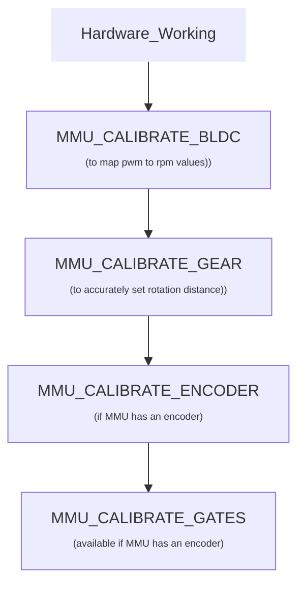

# Build and Flash Firmware Image

1. Refer to [klipper's official installation](https://www.klipper3d.org/Installation.html)

2. `Building the micro-controller` with the configuration shown below.
  * [*] Enable extra low-level configuration options
  * Micro-controller Architecture = `Raspberry Pi RP2040/RP235x`
  * IF USE BOOTLOADER ([see klipper docs](https://www.klipper3d.org/Bootloaders.html#stm32f103-micro-controllers-blue-pill-devices))
    * Bootloader offset = `offset of your bootloader`
  * ELSE
    * Bootloader offset = `No bootloader`
  * Communication interface = `USBSERIAL`
  * GPIO pins to set at micro-controller startup = `gpio4,gpio7`


3. Once the configuration is selected, press `q` to exit,  and "Yes" when  asked to save the configuration.
4. Run the command `make`
5. Flash the MCU
   * IF USE BOOTLOADER
     * Follow the instructions of your bootloader
   * ELSE IF USE NO BOOTLOADER
     * Unplug the Raspberry Pi
     * Hold `Boot` and plug in the Raspberry Pi
     * Run the command `make serialflash FLASH_DEVICE=/dev/serial/by-id/<YOUR USB ID>` for flashing via Serial or
     * OR Copy `~/klipper/out/klipper.uf2` via a windows pc

# Basic configuration
1. Run the `ls /dev/serial/by-id/*` command to get the correct ID number of the RP2040, and set the ID in `mmu.cfg`.
    ```
    [mcu]
    serial: /dev/serial/by-id/usb-1a86_USB_Serial-if00-port0
    restart_method: command
    ```
2. Refer to [klipper's official Config_Reference](https://www.klipper3d.org/Config_Reference.html) to configure the features you want.
3. Refer to [happy-hare's installation guide](https://github.com/moggieuk/Happy-Hare/wiki/Installation) to configure the basic printer settings.
4. In your `mmu/mmu_vars.cfg`, set the `mmu_gear_rotation_distances` variable to `1` for all gaters, as shown below:
    ```
    mmu_gear_rotation_distances: [1, 1, 1, 1, 1, 1, 1, 1]
    ```

# Calibration Steps



## Calibate BLDC
Before calibrating the gear rotation distance, calibrate the BLDC motor. Select a gate belonging to the BLDC unit you want to calibrate and run:

`MMU_CALIBRATE_BLDC MOTOR=<0 or 1>`

The calibration automatically determines the minimum usable PWM and measures the motor RPM across the available PWM range. The resulting PWM-to-RPM map is saved to mmu_vars.cfg and is used by Happy Hare for accurate BLDC speed control. Repeat the calibration for both BLDC units.

## Calibrate rotation distance
see [Happy Hare wiki](https://github.com/moggieuk/Happy-Hare/wiki/MMU-Calibration-TypeB#---step-1-calibrate-rotation-distance-of-gear-0-stepper)

## Calibrate bowden length
see [Happy Hare wiki](https://github.com/moggieuk/Happy-Hare/wiki/MMU-Calibration-TypeB#---step-3-calibrate-bowden-length)

## Calibrating gates
see [Happy Hare wiki](https://github.com/moggieuk/Happy-Hare/wiki/MMU-Calibration-TypeB#---step-4-calibrating-individual-gates)
