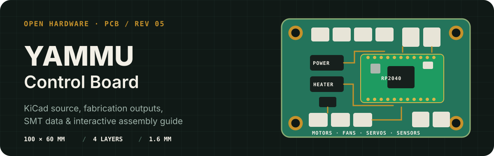
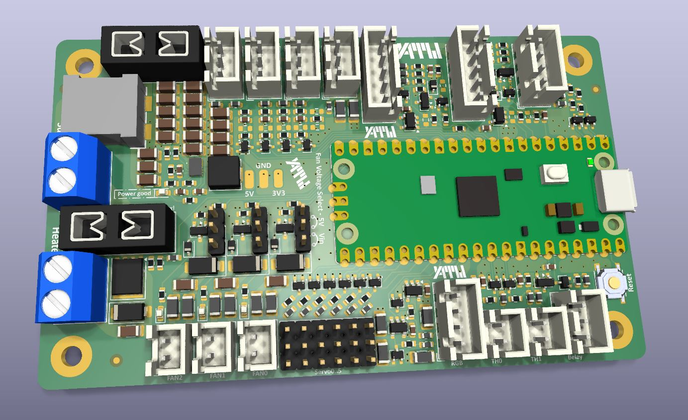
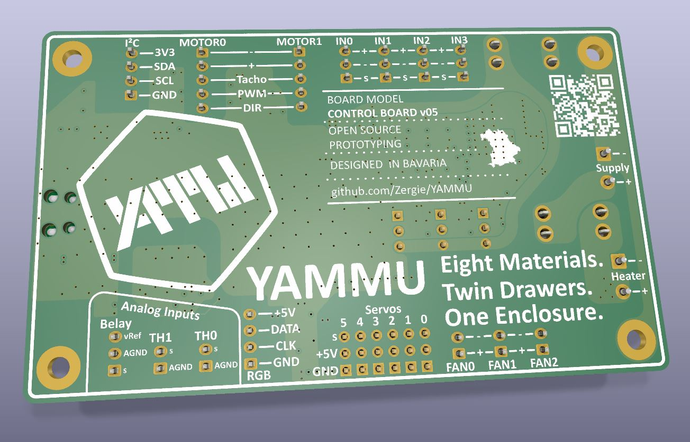
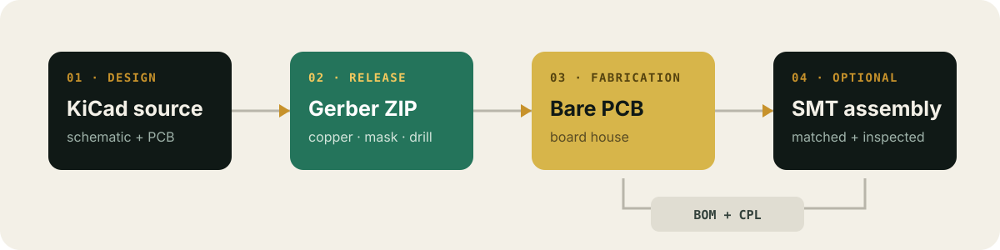

  

  
  
  

This directory contains the editable KiCad design and manufacturing data for the **YAMMU Control Board v05**. The 100 × 60 mm board brings the RP2040 controller, motor and heater control, fan outputs, servos, end stops, analog sensors, I²C, and power regulation onto one board.

## Board preview

| Component side | Solder side |
| :---: | :---: |
|  |  |

| Design fact | Checked-in value |
| --- | --- |
| Board revision | `05` |
| KiCad format | KiCad `9.0` |
| Outline | approximately `100 × 60 mm` |
| Board thickness | `1.6 mm` |
| Copper stack | `4 layers` |
| Assembly side | Top-side placement data; the bottom placement file contains no components |
| Placement records | 220 top-side entries |
| DRC snapshot | [0 violations, 0 unconnected pads](./ControlBoard/DRC.rpt) on 2026-07-11 |

## Find the right file

| Use | File |
| --- | --- |
| Open the complete design | [`YAMMU_ControlBoard_v05.kicad_pro`](./ControlBoard/YAMMU_ControlBoard_v05.kicad_pro) |
| Edit the PCB | [`YAMMU_ControlBoard_v05.kicad_pcb`](./ControlBoard/YAMMU_ControlBoard_v05.kicad_pcb) |
| Read the schematic | [Schematic PDF](./ControlBoard/OutputJob/Schematics/YAMMU_ControlBoard_v05.pdf) |
| Manufacture bare boards | [Gerber + drill ZIP](./ControlBoard/OutputJob/YAMMU_ControlBoard_v05_Gerber.zip) |
| Order SMT assembly | [BOM](./ControlBoard/OutputJob/BOM/YAMMU_ControlBoard_v05_BOM.xlsx) + [top-side CPL](./ControlBoard/OutputJob/Centroid/TopCentroid.xlsx) |
| Hand-assemble or inspect | [Interactive BOM](./ControlBoard/Interactive%20Bom/ibom.html) |
| Check component outlines | [Front fabrication drawing](./ControlBoard/OutputJob/BestPlan/YAMMU_ControlBoard_v05-F_Fab.pdf) · [Back fabrication drawing](./ControlBoard/OutputJob/BestPlan/YAMMU_ControlBoard_v05-B_Fab.pdf) |

  

## Order a bare PCB

[JLCPCB](https://jlcpcb.com/) is one example board house; the same release files can be used with another manufacturer. Prices, capabilities, and form labels change, so treat the provider's current documentation as authoritative.

1. Open the board house's PCB quote page and upload the **ZIP itself**. For JLCPCB, use the [Gerber + drill ZIP](./ControlBoard/OutputJob/YAMMU_ControlBoard_v05_Gerber.zip).
2. Compare the detected result with the design: approximately **100 × 60 mm**, **4 copper layers**, and **1.6 mm** finished thickness. Select the required material, copper weight, solder-mask color, surface finish, quantity, and any other fabrication options; do not rely on automatic detection for choices that are not encoded in the Gerbers.
3. Open the provider's Gerber viewer. Inspect all four copper layers, the continuous board outline, all drills and slots, both masks, and both silkscreens.
4. Save the item to the cart, review manufacturing warnings, shipping, tax, and lead time, then submit the order.

JLCPCB's current walkthrough is available in its [official PCB ordering guide](https://jlcpcb.com/help/article/how-do-i-place-an-order). The online preview is a useful final check, but it does not replace reviewing the KiCad design and release contents.

## Order SMT assembly

An assembly order needs three data sets:

| Upload | What it tells the assembler | This repository |
| --- | --- | --- |
| **Gerbers + drills** | How to fabricate the bare board | [`YAMMU_ControlBoard_v05_Gerber.zip`](./ControlBoard/OutputJob/YAMMU_ControlBoard_v05_Gerber.zip) |
| **BOM** | Which part belongs at each reference designator | [`YAMMU_ControlBoard_v05_BOM.xlsx`](./ControlBoard/OutputJob/BOM/YAMMU_ControlBoard_v05_BOM.xlsx) |
| **CPL / centroid / pick-and-place** | Each component's X/Y position, rotation, and board side | [`TopCentroid.xlsx`](./ControlBoard/OutputJob/Centroid/TopCentroid.xlsx) |

The BOM contains `Designator`, `Comment`, `Footprint`, `Amount`, and `JLCPCB Part #` columns. The CPL contains `Designator`, `Mid X`, `Mid Y`, `Rotation`, and `Layer`. The reference designators must match between the two files.

For a JLCPCB PCBA order:

1. Start a PCB order, upload the corrected Gerber ZIP, and enable **PCB Assembly** before checkout.
2. Select top-side assembly. The current top CPL has 220 placement records. The bottom CPL has no components and is not used for assembly.
3. Upload the BOM and top-side CPL, then let the service process and match them.
4. Review every unmatched or substituted component. Confirm value, package, manufacturer part number or JLCPCB/LCSC part number, stock, and quantity. “No part selected” means that item will not be fitted.
5. Inspect the placement preview at high zoom. Check connector orientation, polarized capacitors and diodes, IC pin 1, rotations, and the board origin. Do not approve the job solely because the files were accepted.
6. Confirm which through-hole, module, connector, or otherwise unsupported parts must be installed by hand after delivery.

JLCPCB documents the current flow in its [official PCBA ordering guide](https://jlcpcb.com/help/article/how-do-i-place-a-pcba-order). Its [BOM/CPL preparation guidance](https://jlcpcb.com/help/article/advice-for-bom-and-cpl-files-preparation) explains reference matching, supported headers, coordinates, and common upload problems.

> [!IMPORTANT]
> Component availability and assembly capabilities are live manufacturing constraints, not properties of this repository. Always re-check part matches and the placement preview for the specific order.

## Use the Interactive BOM

[`Interactive Bom/ibom.html`](./ControlBoard/Interactive%20Bom/ibom.html) is a self-contained browser view generated from the PCB. Download or clone the repository and open the file locally—no KiCad installation or web server is required.

Use it to:

- click a BOM row and highlight the matching footprints on the board;
- pan, zoom, and switch between board sides;
- search by reference, value, or footprint;
- group identical parts and inspect their board locations;
- tick off parts while hand-placing or checking a finished assembly.

The Interactive BOM is an **assembly and inspection aid**. It is not the BOM spreadsheet, not pick-and-place data, and not a file to upload for SMT assembly. Use the `.xlsx` BOM and CPL listed above for the manufacturer.

## License

This PCB is part of the YAMMU open-hardware project. See the repository's [GNU GPL v3.0 license](../LICENSE).
