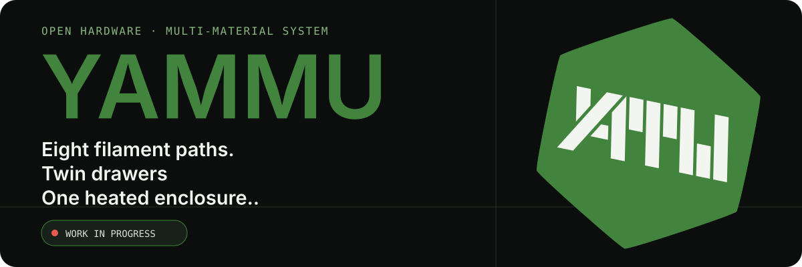
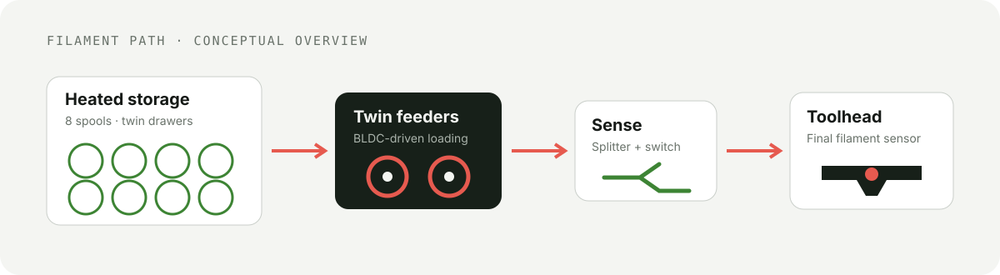
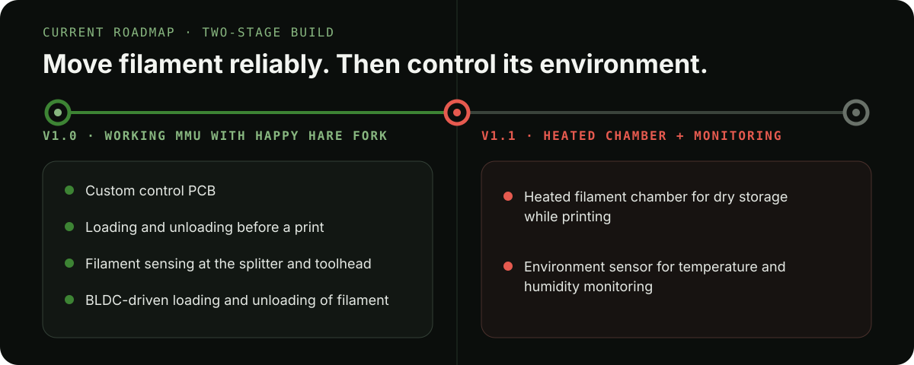

  

  
  
  

YAMMU is an open, Voron-inspired multi-material unit for FFF printers. It combines eight filament paths, enclosed heated storage, BLDC-driven loading, filament sensing, custom electronics, and Klipper-based control in one machine.

> [!IMPORTANT]
> **YAMMU is a work in progress.** The current goal is reliable loading and unloading before or at the start of a print. Multi-color and multi-material printing are planned, but are not the present focus.

## See the machine

| Complete enclosure | Twin spool carrier | Heated chamber | Custom electronics bay |
| :---: | :---: | :---: | :---: |
|  |  |  |  |

## One system, four jobs

- **Store** — eight spools live in two enclosed drawers built around 2020 extrusion.
- **Dry** — the sealed filament chamber is heated for dry storage while printing.
- **Move** — two BLDC-driven feeders load filament through short inlet paths and toward the extruder.
- **Verify** — switches at the splitter and toolhead let the control system confirm filament progress.

  

## Built as open hardware

The repository contains the mechanical, electrical, firmware, and assembly material needed to follow the project—not just product renders.

| Area | What is included | Start here |
| --- | --- | --- |
| Mechanical | STEP assembly, printable STLs, and panel DXFs | [CAD](./CAD) · [STLs](./STLs) · [DXFs](./Drawings_DXFs) |
| Electronics | Main, connector, and sensor-board source and manufacturing files | [PCB files](./PCB) - new version soon! |
| Firmware | RP2040 build notes and YAMMU configuration for Klipper / Happy Hare | [Firmware guide](./Firmware/README.md) - new version soon! |
| Assembly | Illustrated assembly manual | [Open the PDF](./Manual/Assembly.pdf) |

## Start exploring

1. Inspect the [STEP assembly](./CAD/Assembly.step) or browse the ready-to-print [STLs](./STLs).
2. Read the [assembly manual](./Manual/Assembly.pdf) to understand the current mechanical build.
3. (unfinished) Review the [PCB feature set](./PCB/README.md) and manufacturing files.
4. (unfinished) Follow the [firmware guide](./Firmware/README.md) for the current RP2040, Klipper, and Happy Hare setup.

## Current roadmap

  

[View v1.0 progress](https://github.com/Zergie/YAMMU/issues?q=is%3Aissue%20milestone%3Av1.0)
[View v1.1 progress](https://github.com/Zergie/YAMMU/issues?q=is%3Aissue%20milestone%3Av1.1)

## Help build YAMMU

The project especially needs help with prototype testing, CAD, electronics, firmware, and documentation. If you can test the current iteration or improve one part of the system, open an issue or pull request—or join the [YAMMU Discord](https://discord.gg/QSjW5CMHZC).

## Credits and related projects

YAMMU builds on ideas and parts from the wider open-source 3D-printing community, including [Voron Trident](https://github.com/VoronDesign/Voron-Trident), [ERCF v2](https://github.com/Enraged-Rabbit-Community/ERCF_v2), and several community designs documented in the repository history. Review source licenses before redistributing derived parts.

<strong>Third-party parts and original licenses</strong>

- [Voron Trident](https://github.com/VoronDesign/Voron-Trident) parts — GNU GPL v3
- [ERCF v2](https://github.com/Enraged-Rabbit-Community/ERCF_v2) parts — GNU GPL v3
- [Stronger Compact Spool Auto-Rewinder](https://www.printables.com/model/784434-stronger-compact-spool-auto-rewinder) by rans_1668459 — GNU GPL v2
- [Voron 2.4 front panel handle, hinge, and magnet latch](https://www.printables.com/model/371692-voron-24-front-panel-handle-hinge-magnet-latch/files) by Jason_116929 — CC BY-SA
- [Removable panel/door kit for Voron V2/Trident](https://www.printables.com/model/702768-kit-for-removable-panelsdoors-for-voron-v2trident-/files) by Victor Mateus Oliveira — GNU GPL v3
- [WAGO 221-415 extrusion mount](https://www.printables.com/model/869020-wago-221-415-extrusion-mount-1by5-and-2by5) by Artxime — GNU GPL v3
- [LRS-200 DIN rail mount](https://www.printables.com/model/254538-lrs-200-din-rail-mount) by CrazyIvan359 — Creative Commons 4.0

Other MMU projects worth exploring include [ERCF v2](https://github.com/Enraged-Rabbit-Community/ERCF_v2), [8-Track](https://github.com/ArmoredTurtle/8-Track-Raven-Alpha), [Primitive Infinite Spool System](https://github.com/Esoterical/PrinterMods/tree/main/Primitive%20Infinite%20Spool%20System), [TradRack](https://github.com/Annex-Engineering/TradRack), and Prusa MMU3.

## License

Repository content is provided under the [GNU General Public License v3.0](./LICENSE). Third-party parts retain their original licenses.
